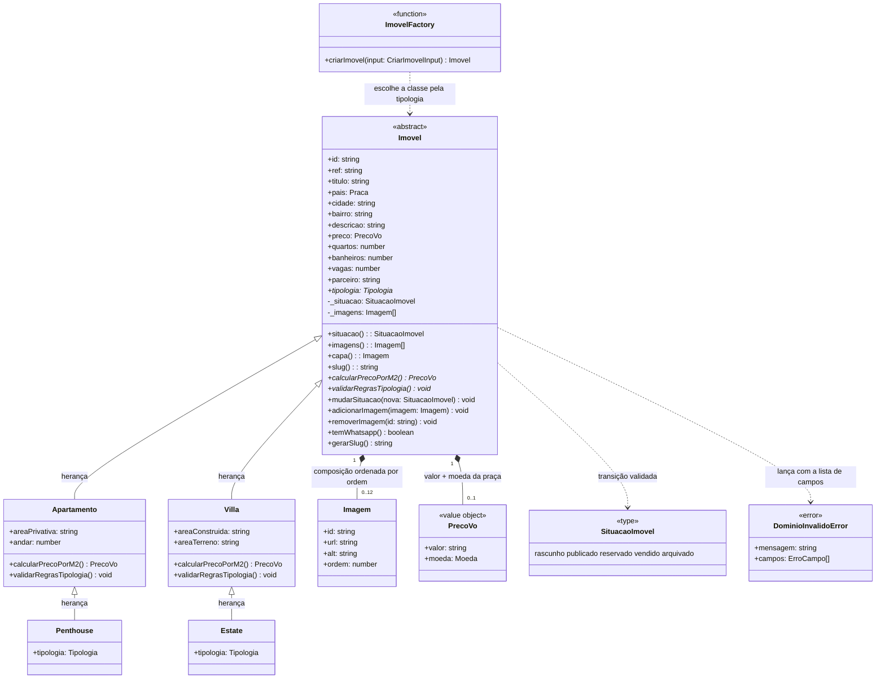

# Portfólio imobiliário com painel

Site público e painel administrativo para um portfólio de imóveis em três praças (BR, PA, AE).
TypeScript estrito + Node + Fastify 5 + SQLite, com **renderização no servidor e zero JavaScript no
navegador**: os formulários do painel enviam `application/x-www-form-urlencoded` e respondem com
redirecionamento (POST/Redirect/GET), e filtros, busca e ordenação do catálogo vivem na URL.

O manifesto de execução automatizada está em [`banca.json`](banca.json).

## Stack

| Peça | Para quê |
|---|---|
| TypeScript 7 (`strict`, `verbatimModuleSyntax`, `nodenext`) + ESM | código-fonte; a saída compilada vai para `dist/` |
| Fastify 5 | HTTP, roteamento, parser de corpo, logger |
| `@fastify/view` + Eta | templates SSR (`src/views`), com escape por padrão em `<%= %>` |
| `@fastify/cookie` | cookie de sessão assinado com `SEGREDO_APP` |
| `@fastify/multipart` | upload de foto (limite de 5 MB e 1 arquivo por requisição) |
| `@fastify/rate-limit` | teto de tentativas de login por IP |
| `@fastify/cors` | liberado para a API ser consumida de fora (Postman) |
| better-sqlite3 (WAL) | banco relacional local, migrações em `migracoes/` |
| `@node-rs/argon2` | hash de senha (memoryCost 19456, timeCost 2, parallelism 1) |
| Vitest | 162 testes em 11 arquivos, rodando contra o app com `app.inject` |

## Requisitos

- Node.js 20.19 ou superior (testado em v22 e v24) e npm.
- Nenhuma ferramenta de build nativo: `better-sqlite3` e `@node-rs/argon2` trazem binários prontos para
  Windows/Linux/macOS. Por isso o `.npmrc` do projeto vem com `ignore-scripts=true` — `npm ci` não
  executa scripts de pacotes de terceiros (nem o `node-gyp` que o npm tentaria rodar para o SQLite).
- O `package-lock.json` registra os binários nativos do rolldown/Vitest das cinco plataformas; onde o
  `os`/`cpu` não bate com a máquina, o npm simplesmente ignora aquela entrada.

## Rodando do zero

São exatamente os cinco comandos do `banca.json`, nesta ordem:

```bash
npm ci              # instalar
npm run migrar      # criar o esquema SQLite em dados/banco.sqlite
npm run semear:teste# importar os 18 imóveis de dados/imoveis-exemplo.csv e as fotos de imagens/
npm start           # roda npm run build e sobe em http://localhost:3000
npm test            # suíte completa (162 testes)
```

Não é preciso criar `.env` para o primeiro rodada: sem `SEGREDO_APP` o servidor entra em modo de
desenvolvimento com um segredo efêmero (aviso no console; as sessões caem a cada reinício) e, sem
`ADMIN_SENHA`, o seed sorteia a senha do administrador e a imprime uma única vez.

```bash
curl -i http://localhost:3000/saude   # HTTP 200 + {"ok":true} -> o "prontoQuando" do manifesto
```

Build manual (o `npm start` já chama `npm run build` antes de subir; o build está dentro do `start`
e não num `prestart` porque `ignore-scripts` desliga os ciclos de vida):

```bash
npm run build   # tsc && tsx scripts/copiar-views.ts
```

## Variáveis de ambiente

Nada de segredo no repositório: só `.env.example` é versionado, com placeholder de desenvolvimento.
O `.env` local fica fora do git (`.gitignore`). As variáveis são lidas em `src/config/ambiente.ts`,
que valida tudo e falha cedo com `ConfiguraçãoInvalidaError`.

| Variável | Padrão | O que faz |
|---|---|---|
| `PORT` | `3000` | porta HTTP |
| `NODE_ENV` | `development` | `production` força cookie `Secure` e segredo obrigatório |
| `DB_PATH` | `./dados/banco.sqlite` | arquivo SQLite (aceita `DATABASE_URL` no formato `file:`) |
| `UPLOAD_DIR` | `./uploads` | pasta das fotos gravadas; servida por `GET /media/:arquivo` |
| `SEGREDO_APP` | — | assinatura do cookie; mínimo 32 caracteres, obrigatório fora de desenvolvimento |
| `SESSAO_TTL_SEGUNDOS` | `86400` | validade da sessão (teto de 30 dias) |
| `COOKIE_SECURE` | `false` | `true` exige HTTPS; em produção sempre é `true` |
| `ADMIN_EMAIL` | `admin@realestate.example` | e-mail do administrador criado pelo seed |
| `ADMIN_SENHA` | — | sem valor, o seed sorteia e imprime a senha uma vez |
| `WHATSAPP_E164` | — | número do botão de WhatsApp; sem valor válido o botão não aparece |

## Entrando no painel

`http://localhost:3000/admin` → redireciona para `/admin/login`. Use o `ADMIN_EMAIL` + `ADMIN_SENHA`
do seed (ou a senha sorteada impressa no console). A sessão é um cookie `sessao_id` HttpOnly, assinado,
`SameSite=Lax`; sair apaga o cookie e a linha no banco.

## Rotas

**Site público**

| Método | Rota | O que entrega |
|---|---|---|
| `GET` | `/` | Início com destaques e textos institucionais do banco |
| `GET` | `/imoveis` | Catálogo com filtros de praça/tipologia/situação, ordenação e paginação na URL |
| `GET` | `/imoveis/:slug` | Ficha do imóvel, preço por m² e botão de WhatsApp |
| `GET` | `/css/:arquivo` | CSS de `public/css`, com allowlist de nome |
| `GET` | `/media/:arquivo` | Fotos de `UPLOAD_DIR`, com o `Content-Type` do formato real |
| `GET` | `/saude` | Healthcheck `{ ok: true }` |

**Painel (SSR, todos exigem sessão)**

`GET /admin` (lista com KPIs, filtros laterais e busca) · `GET|POST /admin/imoveis/novo` ·
`GET|POST /admin/imoveis/:id/editar` · `POST /admin/imoveis/:id/situacao` ·
`POST /admin/imoveis/:id/excluir` · `POST /admin/imoveis/:id/fotos` · `GET /admin/textos` ·
`POST /admin/textos/:pagina` · `GET|POST /admin/login` · `POST /admin/logout`

**API JSON (`/api/v1`)**

`POST /auth/login` · `POST /auth/logout` · `GET /imoveis` · `GET /imoveis/:slug` ·
`POST /admin/imoveis` · `PATCH /admin/imoveis/:id` · `POST /admin/imoveis/:id/situacao` ·
`DELETE /admin/imoveis/:id` · `POST /admin/imoveis/:id/imagens` (multipart) ·
`DELETE /admin/imoveis/:id/imagens/:imagemId` · `PUT /admin/textos/:pagina`

Fora do painel, os erros seguem o contrato do Anexo D: `{ "erro": "requisicao_invalida" }`,
`{ "erro": "nao_autenticado" }`, `{ "erro": "rota_nao_encontrada" }` e `falha_interna` para 5xx.

## As duas animações CSS

Estão em `public/css/estilos.css`, usam apenas `transform` e `opacity` (nada de `left`/`width`, para
não forçar reflow) e são as **duas** animações do site — o painel (`public/css/painel.css`) reaproveita
a transição da elevação e não declara nenhum `@keyframes` novo.

**1 · `surgir` — entrada dos cards em cascata** (`@keyframes surgir`, aplicada em `.grade li`)

- De `opacity: 0; transform: translateY(var(--sp-3))` (12 px abaixo) para `opacity: 1; translateY(0)`.
- Duração `var(--tempo-entrada)` = **260 ms**, `ease-out`, `both` (o card nasce invisível e termina parado).
- Escalonamento por `:nth-child(2)` a `:nth-child(6)` com `animation-delay: calc(var(--atraso-cartao) * n)`,
  onde `--atraso-cartao` = **40 ms** → 40/80/120/160/200 ms.

**2 · elevação — cartão e botão sobem ao receber mouse ou foco do teclado**

- `.cartao, .botao { transition: transform var(--tempo-suave) ease-out, opacity var(--tempo-suave) ease-out }`,
  com `--tempo-suave` = **180 ms**.
- `.cartao:hover, .cartao:focus-visible, .botao:hover, .botao:focus-visible { transform: translateY(calc(var(--elevacao) * -1)) }`,
  com `--elevacao` = `var(--sp-1)` = **4 px** para cima.

Ambas são desligadas por `@media (prefers-reduced-motion: reduce)`, que zera `animation` e
`transition` e força `opacity: 1` nos cards — o conteúdo aparece completo, sem movimento.

## Diagrama de classes

A hierarquia de `Imovel` é o eixo do domínio: a base guarda o que toda tipologia tem e valida; cada
especialização acrescenta suas medidas próprias e sua regra. `Penthouse` herda de `Apartamento` (é um
apartamento com andar alto e regras idênticas) e `Estate` herda de `Villa`, então o preço por m² sai
da mesma fórmula para os dois pares.



- **Herança** só onde o enunciado pede especialização real (`imovel.base.ts` → `apartamento.ts` /
  `villa.ts` → `penthouse.ts` / `estate.ts`).
- **Composição** para o que é parte e tem vida própria: `Imagem` (até 12 por imóvel, ordenadas, a
  primeira é a capa) e `PrecoVo` (valor decimal + moeda, conferidos contra a praça).
- **Fábrica** (`imovel.factory.ts`) em vez de switch espalhado: a rota, o serviço e o seed pedem
  `criarImovel({ tipologia, ... })` e recebem a classe certa.
- **Sem herança** na camada de aplicação: repositórios, serviços e rotas são módulos de funções que
  recebem dados, porque não há estado a compartilhar.

## Testes

```bash
npm test
```

162 testes em 11 arquivos, todos contra o app real (`app.inject`) com banco SQLite em arquivo
temporário — nenhum teste depende de servidor ligado nem de rede:

| Arquivo | O que cobre |
|---|---|
| `imovel-validacoes`, `imovel-calculos`, `imovel-situacao` | domínio: regras por tipologia, preço por m², máquina de situações |
| `autenticacao` | argon2id, sessão assinada, HttpOnly, rate limit de login, proteção do painel |
| `painel-imoveis` | cadastro, edição e transição pelo painel SSR e pela API |
| `exclusao-painel` | bloco de detalhamento (filtros, busca, contagem) e exclusão pelo painel e por `DELETE` |
| `fotos-upload` | magic numbers, limite de 5 MB, capa, remoção e servir `/media` |
| `textos` | textos institucionais editáveis e refletidos no site |
| `catalogo`, `ficha-imovel` | catálogo público, filtros na URL, 404 amigável e ficha |
| `checklist-visual` | conformidade do HTML/CSS público com o checklist visual e de acessibilidade |

## Estrutura

```text
src/
├── config/        # ambiente.ts: lê e valida variáveis de ambiente
├── entities/      # domínio: Imovel (abstrata), tipologias, Imagem, PrecoVo, Situação, erros
├── infra/         # db.ts (SQLite WAL) e armazenamento/upload.ts (validação e gravação de fotos)
├── modules/
│   ├── admin/     # imóveis, fotos, textos: serviço + rotas JSON + rotas SSR do painel
│   └── auth/      # sessão, login JSON e página de login
├── repositories/  # SQL de imóveis, imagens, textos; senhas e hook de proteção do painel
├── routes/        # site público, catálogo, ficha, estáticos, mídia, saúde
├── services/      # casos de uso do site (catálogo e ficha)
├── utils/         # formatação de valores, linhas do painel, mensagens de campo
└── views/         # templates Eta (site/ e admin/, com layout compartilhado do painel)
migracoes/         # SQL versionado (0001_criar_tabelas.sql)
scripts/           # migrar.ts, semear-teste.ts, copiar-views.ts
dados/             # planilha de exemplo e o banco gerado (fora do git)
imagens/           # fotos de exemplo e o índice arquivo → ref
public/css/        # tokens.css (Anexo B), estilos.css (site) e painel.css (painel)
tests/             # Vitest
```

## Segurança: o que está implementado

- Senhas com **argon2id** e parâmetros nomeados; nenhuma senha padrão no repositório (o seed sorteia
  a senha se `ADMIN_SENHA` não vier no ambiente) e nenhum segredo versionado.
- Sessão em **token aleatório** guardado na tabela `sessoes`, nunca derivado de dados do usuário;
  cookie `HttpOnly`, `SameSite=Lax`, assinado, `Secure` obrigatório em produção, com TTL configurável.
- **Rate limit** no login (10 tentativas por minuto por IP) e verificação de senha com hash
  reserva quando o e-mail não existe, para não revelar quais e-mails têm conta.
- Toda ação do painel é **validada no servidor** (hook `preHandler` cobre `/admin` e `/api/v1/admin`);
  as regras de domínio rodam de novo na escrita, independente do que o formulário mostrou.
- Templates com **escape por padrão** (`<%= %>`); nada do que o usuário digita vira código para outro
  visitante, e o teste de painel cobre um título com `<script>`.
- Upload: extensão + `Content-Type` + **magic numbers** conferidos, nome regerado em UUID, limite de
  5 MB e 1 arquivo, e o conteúdo servido com o tipo do formato detectado.
- SQL sempre parametrizado (better-sqlite3 `prepare`/`run`), incluindo filtros e ordenação do catálogo,
  que só aceitam valores de uma lista fechada.
- Exclusão de imóvel apaga primeiro as linhas (as fotos caem por `ON DELETE CASCADE`) e só depois os
  arquivos do disco.

## Limitações conhecidas

- Rate limit e sessões vivem no processo/SQLite: sem store compartilhada, reiniciar derruba as
  sessões e um cluster não divide os contadores.
- Nenhum `trust proxy` é configurado, então atrás de um proxy o IP rate-limited é o do proxy.
- HTTPS é responsabilidade de quem hospeda; localmente o cookie `Secure` fica desligado por
  `COOKIE_SECURE=false`.
- Não há CSP nem cabeçalhos de hardening (helmet-like): o site é SSR sem scripts de terceiros, mas
  um deploy público deveria adicionar.
- O painel não tem confirmação de exclusão — é escolha de fluxo, registrada no Diário de Decisões.

## Licença

ISC. Projeto de avaliação técnica: imóveis, valores e contatos são fictícios.
